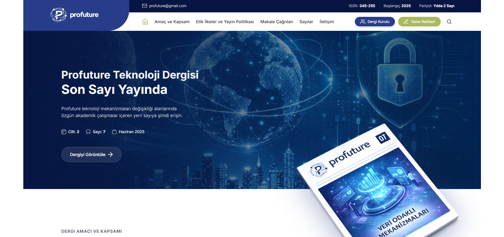
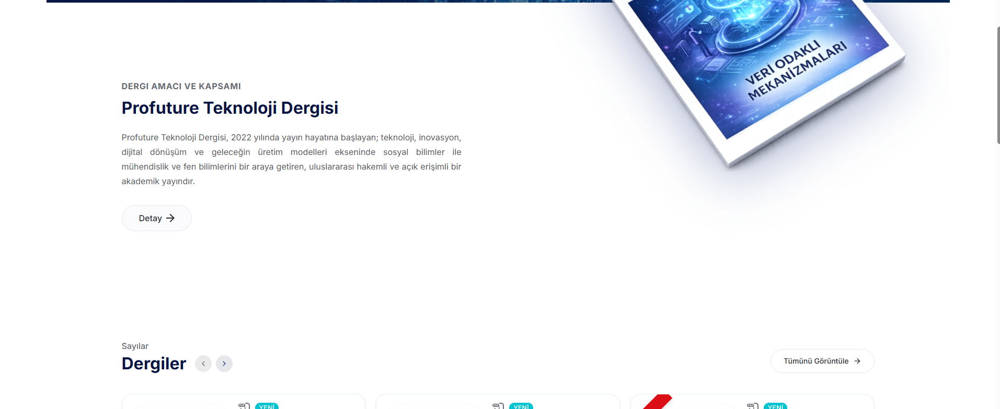
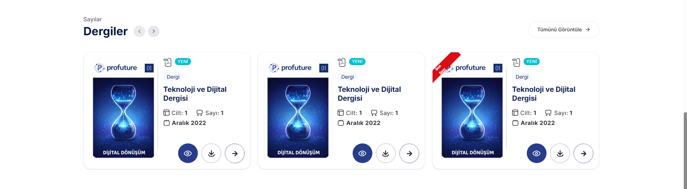
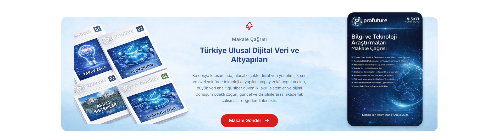
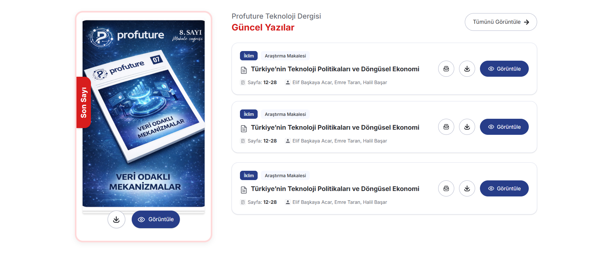
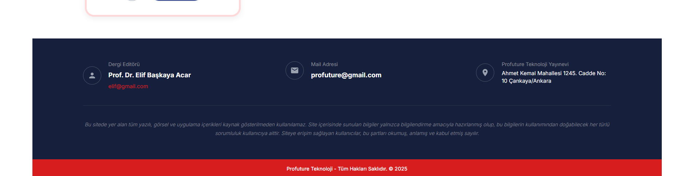

# 📸 Screenshots

| Homepage | Categories | Call For Articles |
| :---: | :---: | :---: |
|  |  |  |

| Call For Papers | Footer | Mobile View |
| :---: | :---: | :---: |
|  |  |  |
# Profuture Magazine - Zeplin Case Study

This project is a modern web application implementation of the Profuture Magazine design, originally provided as a Zeplin case study. It is built using **React 19**, **TypeScript**, and **Tailwind CSS**, focusing on pixel-perfect design, responsiveness, and clean code architecture.

## 🚀 Technologies Used

-   **Framework:** [React 19](https://react.dev/)
-   **Language:** [TypeScript](https://www.typescriptlang.org/)
-   **Styling:** [Tailwind CSS v4](https://tailwindcss.com/)
-   **Build Tool:** [Vite](https://vitejs.dev/)
-   **Icons:** Inline SVGs & Custom Assets

## 📂 Project Structure & Components

The application is structured into modular components found in `src/components`:

-   **`Header`**: Top navigation bar with branding and links.
-   **`Hero`**: Impactful landing section with specific imagery and introductory text.
-   **`IssuesSection`**: Displays recent magazine issues with "New" and "Last Issue" badges.
-   **`CallForArticles`**: A specialized section inviting authors to submit their work (refactored for equal spacing).
-   **`CallForPapers`**: Displays current call for papers with download and view options (data-driven).
-   **`RecentArticles`**: A feed of the latest articles published.
-   **`EditorSection`**: Information about the editorial board.
-   **`Footer`**: Application footer with contact information and legal text (data-driven).

## 🛠️ Getting Started

Follow these steps to set up the project locally:

1.  **Install Dependencies:**
    ```bash
    npm install
    ```

2.  **Run Development Server:**
    ```bash
    npm run dev
    ```

3.  **Build for Production:**
    ```bash
    npm run build
    ```

